# Task Execution Report

## Queries

* Find all items of an order (by order ID)

  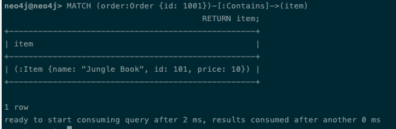

* Calculate total price of an order

  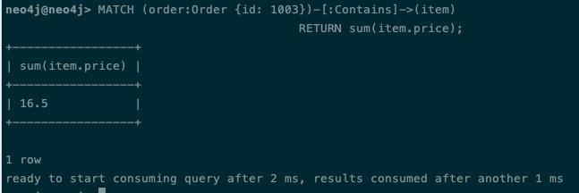

* Find all orders of a customer

  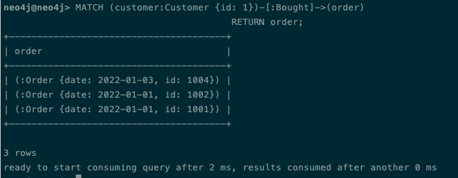

* Find all items bought by a customer (via their orders)

  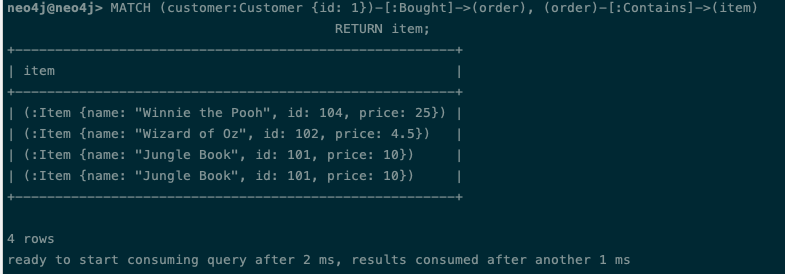

* Find a total count of items bought by a customer (via their orders)

  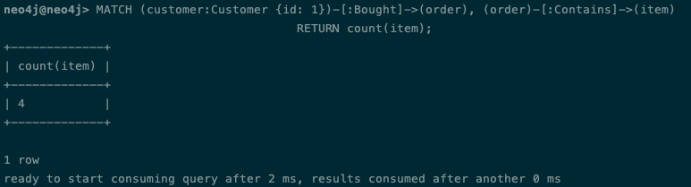

* Find an amount of money spent by a customer (via their orders)

  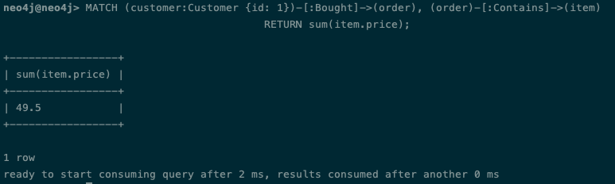

* Calculate how many times each item has been bought (sort by this number)

  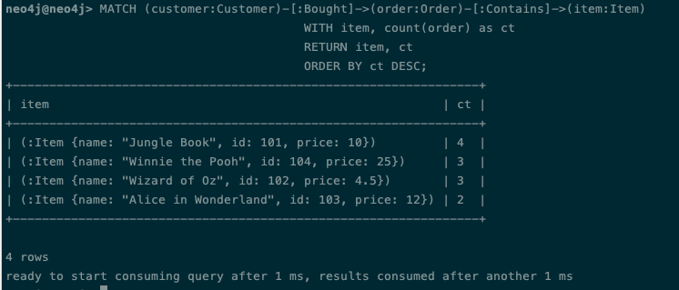

* Find all items viewed by a customer

  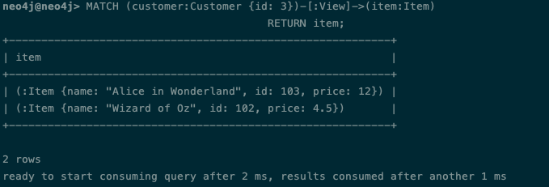

* Find all other items that have been bought with a specific item (via orders with that item)

  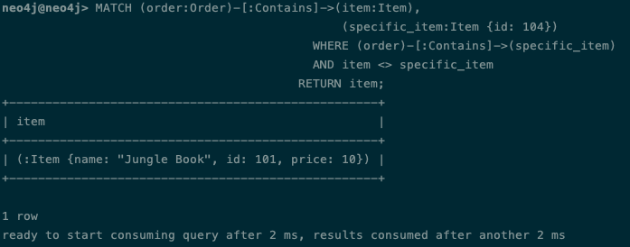

* Find all customers who have bought an item

  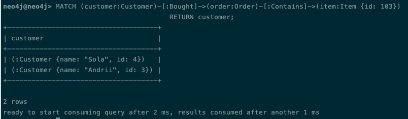

* Find items that have been viewed but haven't been bought by a specific customer

  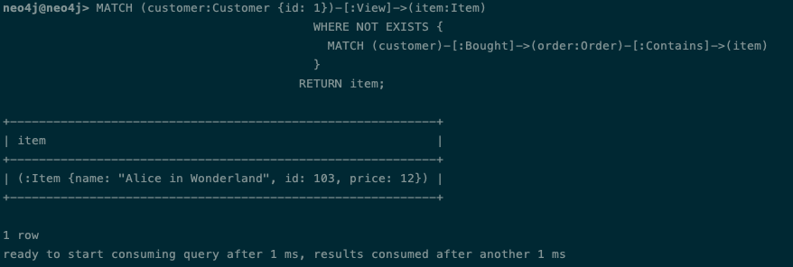
